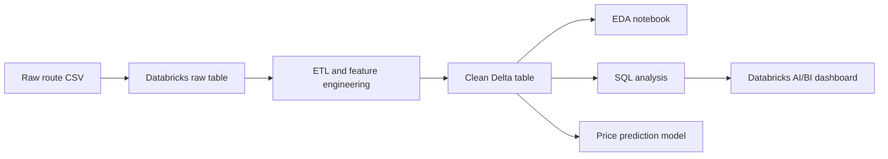
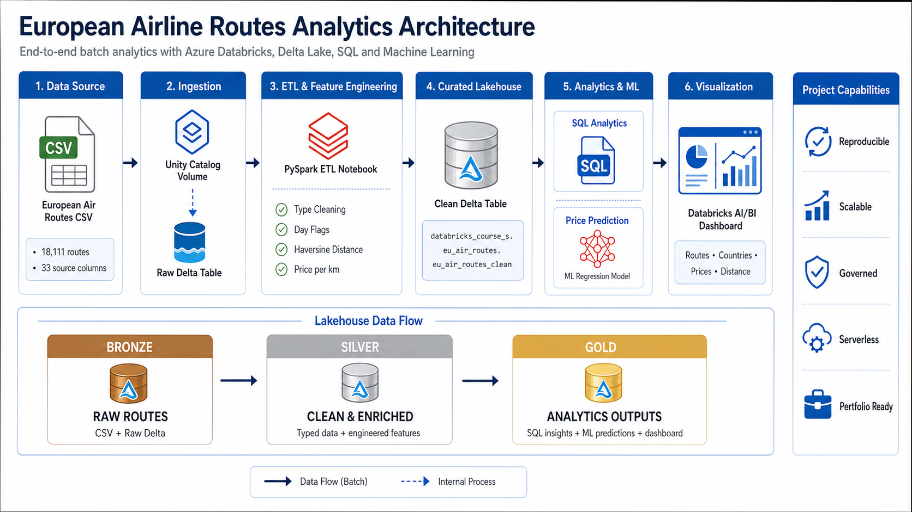
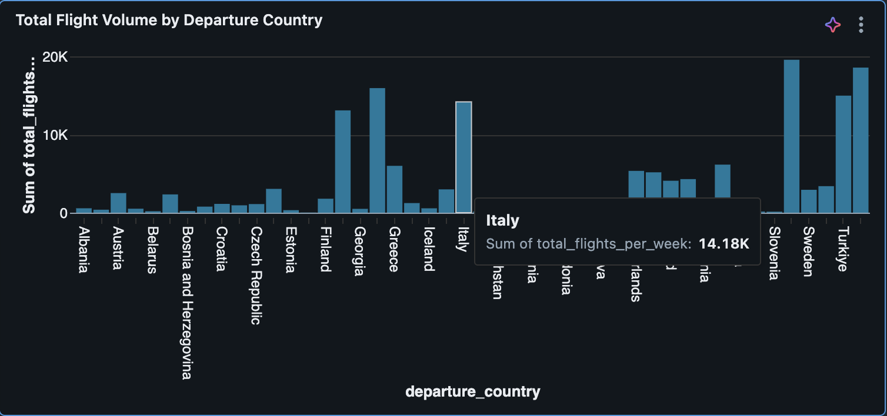
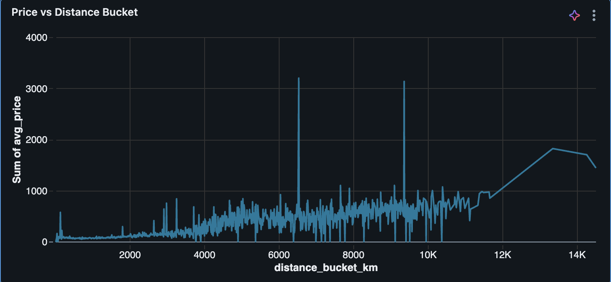
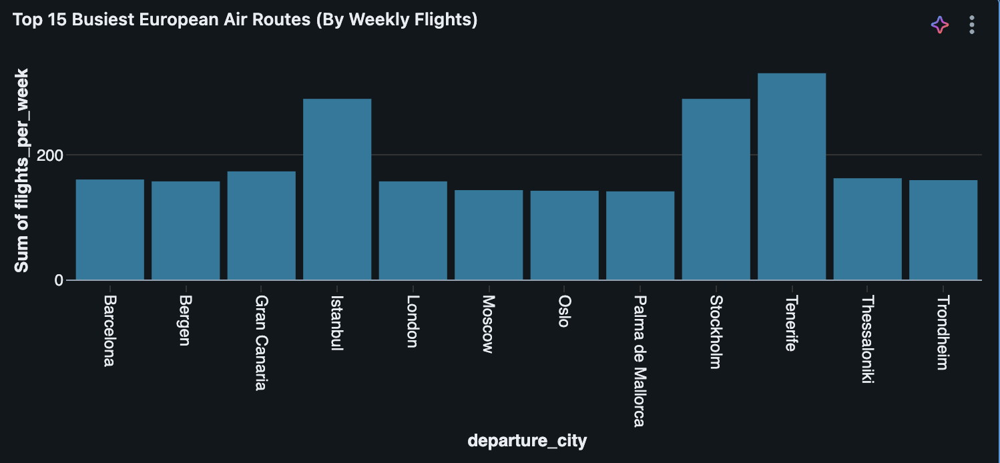
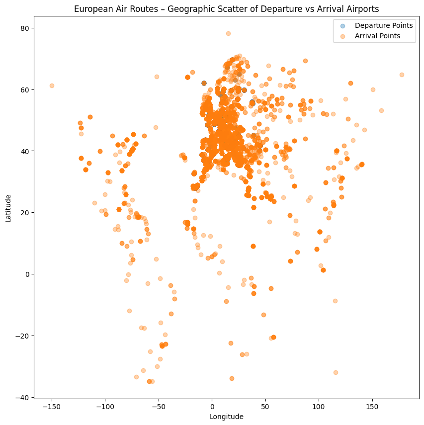
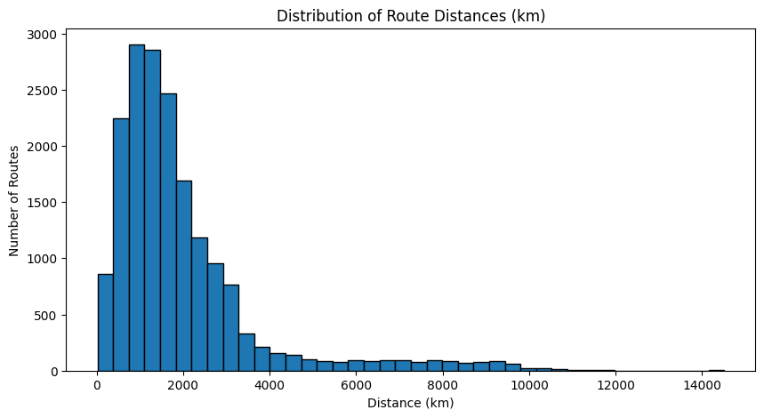
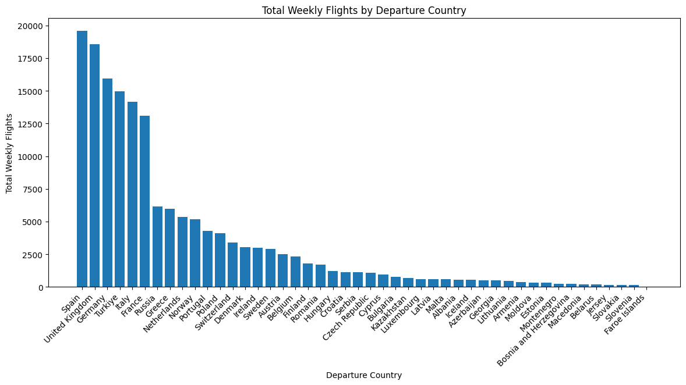
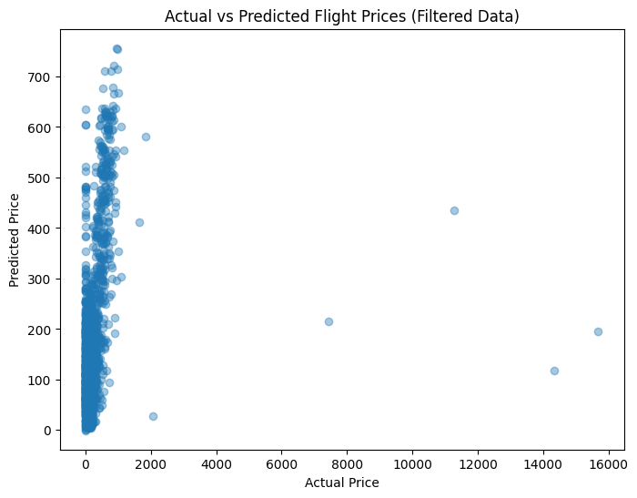

# European Airline Routes Lakehouse Pipeline

An end-to-end Databricks analytics project for European airline route data. The project cleans and enriches route-level flight data, stores the curated output in Delta Lake, builds SQL analytics, includes a Databricks AI/BI dashboard export, and trains a regression model to estimate ticket prices.

This repository is organized as a professional case study with numbered notebooks, a dashboard export, data documentation, architecture notes, and lightweight validation scripts.

## Project At A Glance

| Area | Details |
|---|---|
| Domain | Airline network and route analytics |
| Platform | Databricks, Spark, Delta Lake, Unity Catalog |
| Dataset | European airline routes, prices, schedules, airports, countries, and coordinates |
| Deliverables | ETL notebook, EDA notebook, SQL analysis notebook, Databricks AI/BI dashboard JSON export, ML notebook |
| Modeling Goal | Predict route price using distance, weekly frequency, and operating-day features |
| Analysis Focus | Route demand, country-level flight volume, distance-price behavior, daily routes, price bands |

## Business Objective

Airline network planners and analytics teams need a clear view of route frequency, geographic concentration, price behavior, and operational coverage across European markets.

This project answers:

- Which routes and countries have the highest weekly flight volume?
- How does ticket price vary by distance bucket?
- Which routes operate daily and behave like core network routes?
- How can coordinates be transformed into usable distance and price-per-km metrics?
- Can a simple model explain price using distance and route-frequency features?

## Workflow



## Architecture



The deployed workflow ingests the route CSV into a Unity Catalog volume, materializes raw and cleaned Delta tables, and serves the curated data to SQL analytics, machine learning, and a Databricks AI/BI dashboard.

## Databricks Dashboard

| Weekly flight volume by country | Price vs. distance |
|---|---|
|  |  |



The dashboard surfaces route demand, geographic concentration, and price-distance behavior from the clean Delta table.

## Notebook Analysis

| Geographic airport coverage | Route-distance distribution |
|---|---|
|  |  |

| Weekly flights by departure country | Actual vs. predicted ticket prices |
|---|---|
|  |  |

## Repository Structure

```text
european-airline-routes-lakehouse-pipeline/
├── README.md
├── dashboards/
│   └── databricks/
│       └── eu_air_routes_dashboard.lvdash.json
├── data/
│   ├── README.md
│   └── raw/
│       └── europe_air_routes.zip
├── docs/
│   ├── ARCHITECTURE.md
│   ├── DATA_DICTIONARY.md
│   └── PROJECT_WALKTHROUGH.md
├── notebooks/
│   ├── 01_etl_feature_engineering.ipynb
│   ├── 02_exploratory_analysis.ipynb
│   ├── 03_sql_analysis.ipynb
│   └── 04_price_prediction_model.ipynb
├── outputs/
│   ├── figures/
│   │   └── .gitkeep
│   └── metrics/
│       └── .gitkeep
├── requirements.txt
├── scripts/
│   └── inspect_dataset.py
├── src/
│   └── eu_air_routes/
│       ├── __init__.py
│       └── schema.py
└── tests/
    └── test_schema.py
```

## Notebooks

| Notebook | Purpose |
|---|---|
| `notebooks/01_etl_feature_engineering.ipynb` | Loads raw route data in Databricks, cleans types, engineers route features, and writes the clean Delta table. |
| `notebooks/02_exploratory_analysis.ipynb` | Explores route distribution, nulls, busiest airports, geography, distance, and price relationships. |
| `notebooks/03_sql_analysis.ipynb` | Builds SQL queries for dashboard-ready route and country-level analysis. |
| `notebooks/04_price_prediction_model.ipynb` | Trains a regression model for price prediction using operational and distance features. |

## Dataset

The raw dataset is stored as a compressed CSV bundle:

```text
data/raw/europe_air_routes.zip
```

The zip contains:

```text
europe_air_routes.csv
```

Use the inspection script to verify the file and preview columns:

```bash
python3 scripts/inspect_dataset.py
```

## Databricks Tables

The notebooks use the following Unity Catalog-style table names:

```text
databricks_course_s.eu_air_routes.europe_air_routes_raw
databricks_course_s.eu_air_routes.eu_air_routes_clean
```

The deployed project uses the `databricks_course_s` catalog and `eu_air_routes` schema. If you import the notebooks into another workspace, update the catalog references before running them.

## Feature Engineering

Key engineered fields include:

- Numeric weekday flags from `day1` through `day7`
- `days_operated`
- `is_daily_route`
- Normalized `flights_per_day`
- Haversine `distance_km`
- `price_per_km`

## Databricks AI/BI Dashboard

Databricks supports AI/BI dashboards, formerly known as Lakeview dashboards. This project includes a Databricks dashboard export in `.lvdash.json` format:

```text
dashboards/databricks/eu_air_routes_dashboard.lvdash.json
```

Dashboard views cover:

- Top busiest routes
- Weekly flights by departure country
- Average price by distance bucket
- Daily operating routes
- Price bands by country

## Machine Learning

The ML notebook trains a regression model to estimate route price using:

- `distance_km`
- `flights_per_week`
- `days_operated`

Evaluation focuses on RMSE, R-squared, and predicted-vs-actual price behavior.

## Local Validation

The full ETL workflow runs in Databricks, but the repository includes lightweight local checks:

```bash
python3 -m unittest discover -s tests
python3 scripts/inspect_dataset.py
python3 -m json.tool dashboards/databricks/eu_air_routes_dashboard.lvdash.json > /tmp/dashboard_check.json
```

Validated locally:

- `python3 -m unittest discover -s tests` passed.
- `python3 scripts/inspect_dataset.py` confirmed the included route archive, 33 columns, and no missing expected columns.
- Verified 18,111 rows in both the raw and clean Delta tables.
- Added the deployed Databricks dashboard and notebook output gallery.

## Skills Demonstrated

- Databricks notebook workflow design
- PySpark ETL and feature engineering
- Delta Lake table creation
- Geospatial route-distance calculation
- SQL analytics and dashboard-ready query design
- Airline network analysis
- Regression modeling for route price estimation
